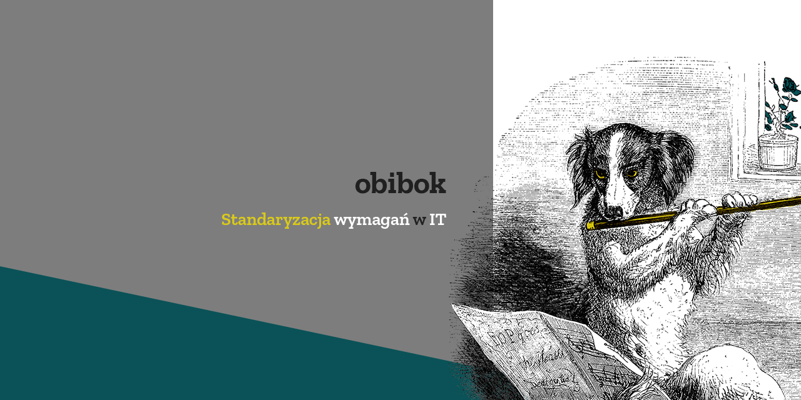

<div align='center'>
    
</div>

<br/>

<h3 align='center' style='font-weight:bold'>
    What does stars, circles and rectangles mean in a job offer?
</h3>

<p align='center'>
    Standarized IT requirements will simplify and quicken hiring process.
</p>

<br/>

<p align='center'>
    <a href='https://github.com/and-end/obibok/releases'>
        
    </a>
    <a href='https://travis-ci.com/and-end/obibok'>
        
    </a>
    <a href='https://codecov.io/gh/and-end/obibok'>
        
    </a>
    <a href='https://codeclimate.com/github/and-end/obibok/maintainability'>
        
    </a>
    <a href='https://github.com/prettier/prettier'>
        
    </a>
    <a href='https://creativecommons.org/licenses/by-nc/4.0/'>
        
    </a>
</p>

<br/>

# obibok

Standarization of IT requirements

## Getting Started

These instructions will get you a copy of the project up and running on your local machine for development and testing purposes.

### Prerequisites

* [Node.js](https://nodejs.org/en/) - latest LTS or current version
* [npm](https://www.npmjs.com/get-npm) - latest version

### Installing

1. Fork, then clone the repo:
```sh
git clone https://github.com/your-username/obibok.git
```

2. Install dependencies and link them to packages:
```sh
npm run bootstrap
```

### Development

Running the `dev` task in `packages/app` will start a development server on `localhost:8000`.

Server supports hot-reloading and auto refreshing, so you don't need to worry about hitting refresh on every change made.
```sh
npm run dev
```

### Building

Running the `prod` task in `packages/app` will create a production-ready version of the app, located in `packages/app/public`.
```sh
npm run prod
```

### Linting, formatting and testing

To run linting:
```sh
npm run lint
```

To run formatting:
```sh
npm run format
```

To run linting or formatting without writing mode:
```sh
npm run lint-dry
```
```sh
npm run format-dry
```

To run tests:
```sh
npm run test
```

## Built With

* [TypeScript](https://www.typescriptlang.org/)
* [Svelte](https://svelte.dev/) - App
* [Sass](https://sass-lang.com/),
    [PostCSS](https://postcss.org/),
    [TailwindCSS](https://tailwindcss.com/) - Styles
* [Firebase](https://firebase.google.com/) - Database, hosting
* [webpack](https://webpack.js.org/) - Bundle

...and more! See package.json for used packages.

## Contributing

Please read [CONTRIBUTING.md](CONTRIBUTING.MD) for details on the process for submitting pull requests to us.

## Versioning

We use [SemVer](http://semver.org/) for versioning. For the versions available, see the [tags on this repository](https://github.com/and-end/obibok/tags).

## Authors

* **Kacper Ochmański** - *Initial work, development, structure, graphics* - [ochmanski](https://github.com/ochmanski)

See also the list of [contributors](https://github.com/and-end/obibok/contributors) who participated in this project.

## License

This project is licensed under the [CC BY-NC 4.0 License](https://creativecommons.org/licenses/by-nc/4.0/deed.pl) - see the [LICENSE.md](LICENSE.md) file for details
